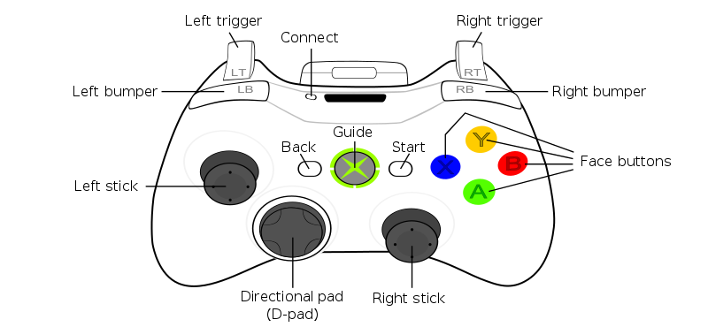

# BlueRov-ROS-playground
Scripts to help BlueRov integration with ROS.
What is possible ?
- Video streaming capture with opencv
- Read and write over mavlink protocol with MAVROS
- Joystick interaction
- Gazebo simulation

  

## Getting Started

### Requirements ###
- git
- [ros-\*-desktop-full](http://wiki.ros.org/ROS/Installation)
  - kinetic or newer
- [mavros](http://wiki.ros.org/mavros)
- python
  - opencv_python
  - numpy
  - [gi, gobject](https://wiki.ubuntu.com/Novacut/GStreamer1.0)
  - PyYAML
- [freefloating_gazebo](https://github.com/freefloating-gazebo/freefloating_gazebo)

### Installation ###
 1. Go to your ROS package source directory:
    - `$ cd ros_workspace_path/src`
 2. Clone this project.
    - `$ git clone https://github.com/olayasturias/bluerov_ros_playground`
 3. Go back to your ROS workspace:
    - `$ cd ../`
 4. Build and install it:
    - `$ catkin build --pkg bluerov_ros_playground`
    - if using ROS from source:
        - `$./src/catkin/bin/catkin_make_isolated --install -DCMAKE_BUILD_TYPE=Release --pkg bluerov_ros_playground`
 5. Reload your ROS env.
    - bash: `$ source install/setup.sh`
    - zsh: `$ source install/setup.sh`

## Running ##

- BlueRov2 node

    For more information check [here](src/bridge/README.md).

- Launch user example

    This example will start user example, reading data from mavlink, interacting with joystick over rc commands and showing ROV video stream.
    - `roslaunch bluerov_ros_playground user_mav.launch`

    In order for the controller to work with this node, the ROV must be in either STABILIZE or MANUAL mode. MANUAL mode can be set as:
    - `rosrun mavros mavsys mode -c MANUAL`

    To run QGC parallel with user_mav, it's necessary to run user_mav first. If it's necessary to change the input, the parameter `joy_dev` can be used to set the one used.

    This node can work with two controllers: the fs-i6 or the xbox 360 joystick.

    The ROV can be controlled with the xbox 360 joystick as follows:
    - SWA:
        - UP: disarm vehicle.
        - DOWN: arm the vehicle.
    - Left stick:
      - Up/Down: move the ROV up and down.
      - Left/Right: rotate around Y axis
    - Right stick:
      - Up/Down: navigate forwards/backwards.
      - Left/Right: yaw movement clockwise and counterclockwise.
    - Directional pad:
      - Up/Down: move the camera servo Up and Down.
      - Left/Right: TBD
    - A button: Gain decrease.
    - B button: Lights brighter.
    - Y button: Gain increase.
    - X button: Lights dimmer.
    - Left bumper: set Manual Control.
    - Right bumper: set Stabilize Control.
    - Left trigger: TBD.
    - Right trigger: TBD.

    

      
    

    The ROV can be controlled with the xbox 360 joystick as follows:
    - Start: arm the vehicle.
    - Back: disarm the vehicle.
    - Left stick:
      - Up/Down: move the ROV up and down.
      - Left/Right: navigate left and right.
    - Right stick:
      - Up/Down: navigate forwards/backwards.
      - Left/Right: yaw movement clockwise and counterclockwise.
    - Directional pad:
      - Up/Down: move the camera servo Up and Down.
      - Left/Right: TBD
    - A button: Gain decrease.
    - B button: Lights brighter.
    - Y button: Gain increase.
    - X button: Lights dimmer.
    - Left bumper: set Manual Control.
    - Right bumper: set Stabilize Control.
    - Left trigger: TBD.
    - Right trigger: TBD.

- Visualize video stream

    Shows video stream using opencv and gstreamer
    - `roslaunch bluerov_ros_playground video.launch`

    To capture video stream in user_mav/video and QGC at same time, it's necessary to modifie [gstreamer options](http://192.168.2.2:2770/camera), changing `! udpsink host=192.168.2.1 port=5600` to `! multiudpsink clients=192.168.2.1:5600,192.168.2.1:5601` and add the udp_port parameter when calling roslaunch (`video_udp_port:=5601`).

- Gazebo

    This example allow SITL communication with Gazebo, right now the only interaction that happen is the thruster control using [thruster pwm fitting](https://colab.research.google.com/notebook#fileId=1CEDW9ONTJ8Aik-HVsqck8Y_EcHYLg0zK).
    - Run SITL and start gazebo.launch
    - `roslaunch bluerov_ros_playground gazebo.launch`

- Gazebo Teleop

    It'll open a window with the camera stream and Gazebo, a joystick can be used to control the ROV.
    - `roslaunch bluerov_ros_playground gazebo_teleop.launch`

    To change the default joystick input (`/dev/input/js0`), it's possible add the parameter `joy_dev:=/dev/input/jsX` when launching the simulation.

- RVIZ

    Visualize 3D model
    - `roslaunch bluerov_ros_playground rviz.launch`

### Running with SITL ###
- Run ArduPilot SITL

    1. [Download ArduPilot and configure SITL](http://ardupilot.org/dev/docs/setting-up-sitl-on-linux.html).
    2. `$ cd ardupilot/ArsuSub`
    3. `$ sim_vehicle.py`

    - To test mavros communication with SITL:
        - `$ roslaunch mavros apm.launch fcu_url:=udp://0.0.0.0:14550@`

- Fake video stream

    - `$ gst-launch-1.0 videotestsrc ! video/x-raw,width=640,height=480 ! videoconvert ! x264enc ! rtph264pay ! udpsink host=127.0.0.1 port=5600`
        - If necessary, change video source and resolution.
        - To test the udp reception: `gst-launch-1.0 -v udpsrc port=5600 ! application/x-rtp, payload=96 ! rtpjitterbuffer ! rtph264depay ! avdec_h264 ! fpsdisplaysink sync=false text-overlay=false`

## Topics ##
If you need more information about the topics and what you can access, take a look [here](doc/topics_and_data.md).

## Software Layer Diagram ##

<pre>
                      +-----------------------+         +------------------------+
                      |     <b>Raspberry Pi</b>      |         |    <b>Topside Commputer</b>   |
                      |    <b>ip 192.168.2.2</b>     |         |     <b>ip 192.168.2.1</b>     |
                      |                       |         |                        |
+-------+  Telemetry  | +-------------------+ |         |                        |
|Pixhawk<-------------->USB         <b>MAVProxy</b>| |         |                        |
+-------+    Pilot    | +                   + |         | +--------------------+ |
            Control   | |            udpbcast<----------->:14550         <b>MAVROS</b>| |
                      | +-------------------+ |  Pilot  | |(UDP)               | |
                      |                       | Control | |                    | |
                      | +-------------------+ |         | |       (ROS)        | |
+---------+           | CSI+2       <b>raspivid</b>| |         | +------+/mavros+-----+ |
|Raspberry+------------>camera              | |         |           ^            |
| Camera  |           | port                | |         |           |            |
+---------+           | +                   | |         | +---------v----------+ |
                      | |                   | |         | |subs.py      pubs.py| |
                      | +------------+stdout+ |         | |                    | |
                      |                  +    |         | |                    | |
                      |             Raw  |    |         | |                    | |
                      |             H264 |    |         | |                    | |
                      |                  v    |         | |      <b>user.py</b>       | |
                      | +------------+ fdsrc+ |         | |                    | |
                      | |<b>gstreamer</b>          | |         | |                    | |
                      | |                   + |         | :5600 video.py       | |
                      | |             udpsink+----------->(UDP)                | |
                      | +-------------------+ |  Video  | +---------^----------+ |
                      |                       | Stream  |           |            |
                      +-----------------------+         |           +            |
                                                        | +--------/joy--------+ |
                                                        | |<b>joy</b>     (ROS)       | |         +--------+
                                                        | |                  USB<----------+Joystick|
                                                        | +--------------------+ |  Pilot  +--------+
                                                        |                        | Control
                                                        +------------------------+
</pre>
